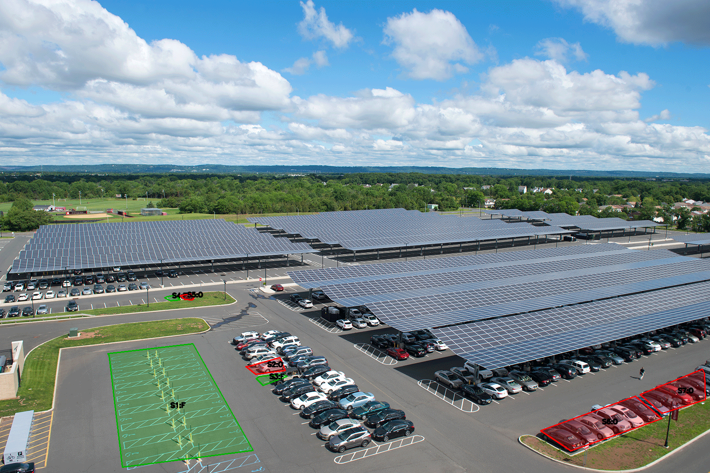

# Parking Occupancy Detector 🚗
As a Rutgers student, I often noticed how hard it was to find a parking spot during **midterms, finals, football games, big events, or festivals**.  
We wasted time and fuel driving through lot after lot looking for an empty space.  
That frustration inspired me to build this project : software that uses image data to highlight which stalls are free so drivers can save **time, money, and effort**.


A student-built computer vision app that marks parking stalls as **free** (green) or **occupied** (red) from a single overhead photo.



---

## How it works
- YOLOv8 detects cars in the image  
- Stall polygons are drawn with a simple label tool  
- Each stall is classified:
  - **Red = Occupied**
  - **Green = Free**

---

## Quickstart
```bash
python3 -m venv .venv
source .venv/bin/activate
pip install -r requirements.txt

python3 src/infer.py --image data/samples/lot1.png \
    --stalls data/stalls/lot1_stalls.csv \
    --model yolov8m.pt \
    --overlap_thresh 0.10 \
    --outdir outputs
```
## Project Structure
```

ParkingOccupancyDetector/
├── data/
│   ├── samples/
│   └── stalls/
├── outputs/
├── src/
│   ├── infer.py
│   └── utils.py
└── requirements.txt
```

---

## Next Steps
- [ ] Add live camera support  
- [ ] Deploy on a small web server (Flask/FastAPI)  
- [ ] Integrate with Rutgers parking data for **real-time** availability  
- [ ] Make an iOS/Android companion app
